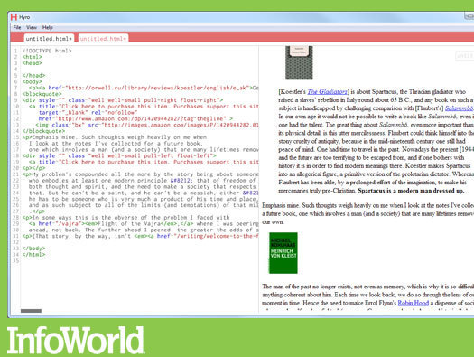

# Project 4

## App Description
  The app I will be building for project 4 is a real-time HTML 5 editor that can be built with Node-Webkit. Raw HTML will be displayed on the left-hand side of the page and the resulting content on the right. Although it is very important to note that it isn't intended to be a full-time Web IDE, but more of a lightweight notepad for typing HTML or CSS and seeing it rendered in real-time.

## Technologies Used
  1. Node-Webkit
  2. HTML
  3. CSS
  4. CodeMirror(syntax highlighting)

## MVP
  MVP will be a working version of the app with possibly sass being another language to render in real-time.

## Wireframes

 

## [Trello](https://trello.com/b/fFPoNIlT/project-4)

Click header above for link to trello.
