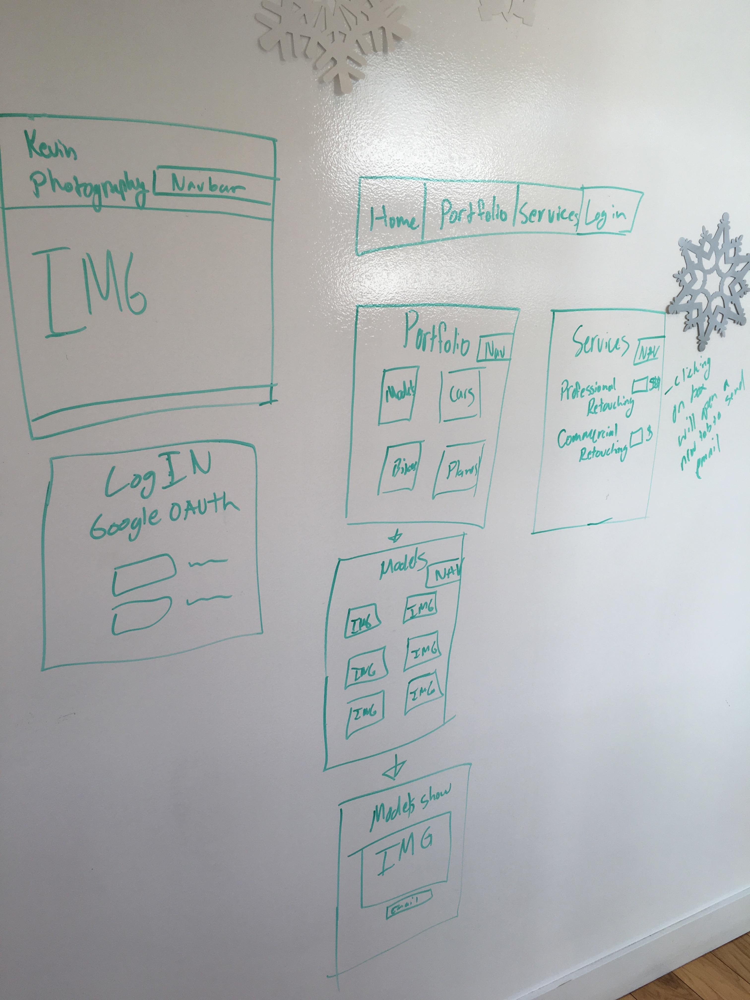
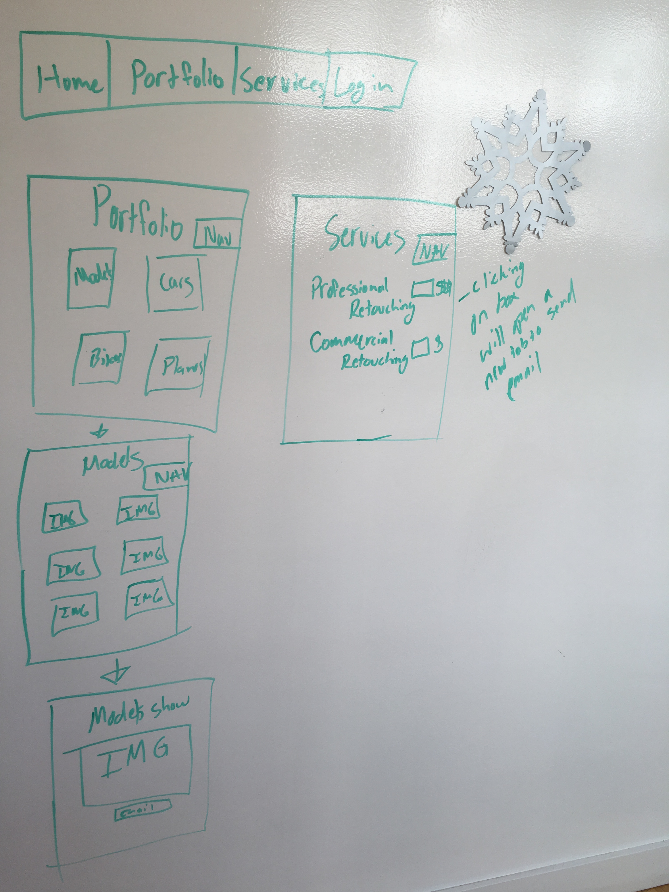
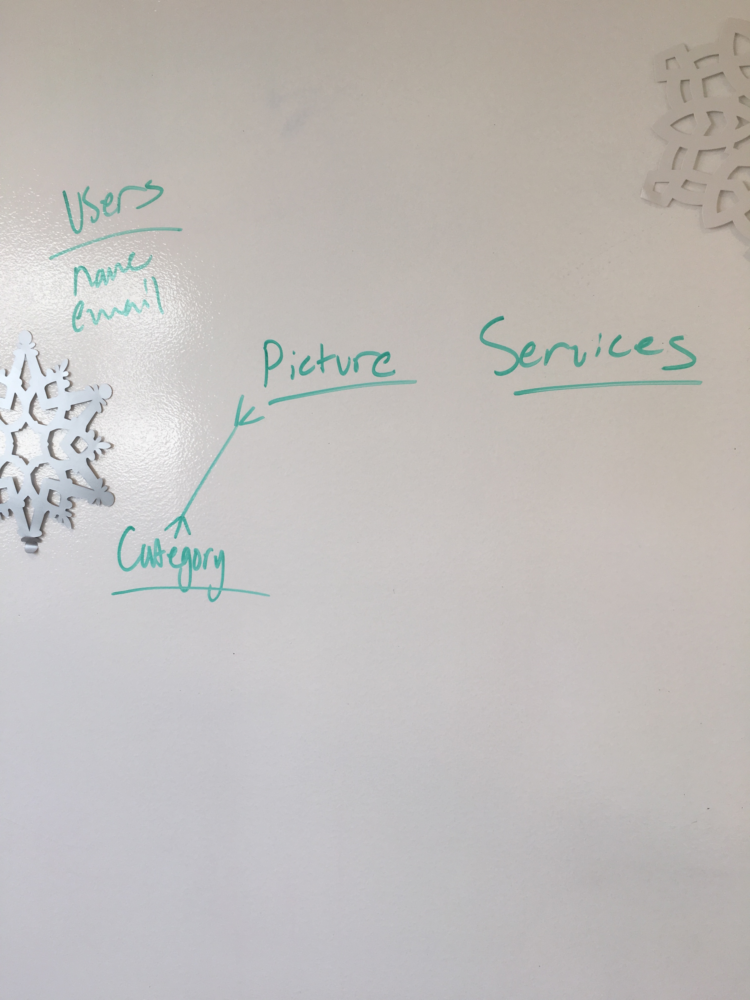

# Project 4

## App Description
  The app I will be building for project 4 is a personal website. I'd like users to be able to go to my site and see work that I have produced. I will also have services available upon request.

## Technologies Used
  1. Mongo
  2. HTML
  3. CSS
  4. Javascript
  5. Node
  6. Angular
  7. Express

## MVP
  MVP will be a working version of the app.

## Wireframes

 
 
 

## [Trello](https://trello.com/b/fFPoNIlT/project-4)

Click header above for link to trello.
